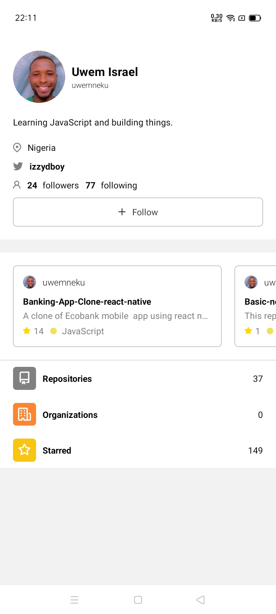
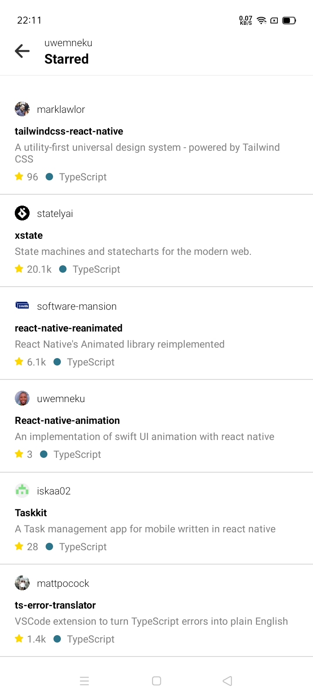

# React Native Github clone

A simple clone of github mobile app using react native, expo and github rest apis.
<br/>
[Expo Preview link](https://expo.dev/@uwemneku/guthub) - Android only.
<br />
For ios you need to set up the app locally - [Read why](https://stackoverflow.com/questions/58402015/published-expo-app-running-in-expo-on-ioss)

## Screenshots

<div align="center" >
    
    
</div>

## Getting started

- Clone repo
  ```sh
  git clone https://github.com/uwemneku/github.git
  ```
- Install dependencies
  ```sh
    yarn install
  ```
- Start the app
  ```sh
    expo start
  ```


